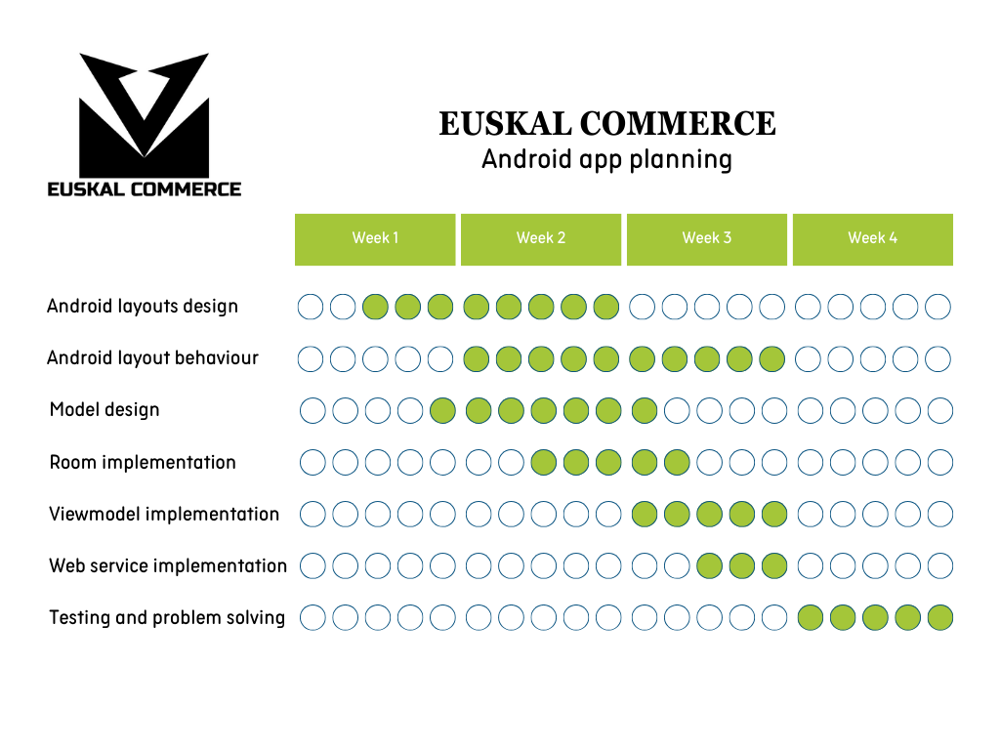

# EUSKAL COMMERCE

## 1. Introduction

For this project what we had to do is to create using Odoo an enterprise infrastructure (a commercial enterprise that will sell and buy some products) and this enterprise will use purchases, sales, inventory, bills and countability modules and to develop a mobile app that connects with the enterprise for the CRM.

The enterprise manager will check the sales evolutions but he is not very good at high-technology and he is not very good at managing Odoo so we will create a control panel to visualize all the data he needs.

On the other hand, he will also have the choice to import and export the system data so, for that we will develop a java desktop application.

On top of that, we will create an app for the sales representatives using Android Studio. In that application we can consult for example: The clients table, products…
To finish with the introduction we will create a service that will open Odoo. 

## 2. Context
In the competitive landscape of emerging enterprises, data has become a crucial asset for informed decision-making and sustainable growth. For new businesses navigating this digital terrain, the challenge lies in managing and extracting value from the influx of data across various facets. Understanding these hurdles, our development team is undertaking a project to implement an Odoo-based solution tailored to address the specific data-related challenges faced by emerging enterprises.
This project emerges from the need of new businesses to have data at their fingertips, and it's goal is to create various tools to facilitate the satisfaction of this need. 

## 3. Objectives

### 3.1. Main Objectives

The main goal is to build the first functional version of a computer service that is going to be able to lead to the implementation of a management system of an enterprise. For this purpose we have analyzed the needs of the enterprise and we have designed a first functional version that will be able to satisfy various activities of the enterprise.

Another main goal is to learn how to manage, design and plan in an effective and correct way a group project. Improving these skills is as important as having the technical knowledge to develop the different software. The resolution of conflicts and co-working with team mates also is a very important skill to take into account. This will give you the experience and value to work on a enterprise and have a good performance.

### 3.2. Concrete Objectives

To complete the main goal we have set some specific objectives. Between these objectives we can highlight these ones:

- Create a center point for the computer service. In this case we have designed and built a Ubuntu server to host the ERP that is going to be able to manage the services of the enterprise, and the database that is going to store all the information that the enterprise needs to offer their products and services.
- Create three different types of software. 
- On one hand, we have designed a data converter application that is going to be able to extract data from the database, convert that data into different format files and read from external files and then add that data to the DB.
- On the other hand, we have designed and created an Android mobile application for the salesman. This application will be able to extract certain data from the DB, pass it to the application into a local database and show that data to the user. 
- Finishing with the software development, we have created a desktop application with a user interface for the director of the enterprise. This application is a control panel that allows the director to visualize more efficiently the most relevant data of the economic activity of the enterprise.
- Install and configure an ERP to manage the enterprise, in this case Odoo.

## 4. Resources

### 4.1. Technical Resources

If we focus on the technical resources the most important resource has been the computers to create all the software. We can say that hardware is a must have resource to create software. Is our raw material.
On the other hand, if we take a look to more detailed resources we can say that the usage of virtual machines has been the key for the building of our server. This virtual machine is a resource created with IsardVDI, is an Ubuntu server based building using the 22.04 version.

Controlling the development process is a very important thing to work between various developers at the same time. Using a controlling version platform like GitHub gives the chance to developers to have control over the different states of the development process. If something went wrong it just need to take the previous version and start working from there.

We have also used GitHub Projects to create the tasks of each development unit and to do a preliminary planning of the timing of the tasks. This tool is a very useful resource to have control of the process. You can resolve incidents, tag and assign the different tasks to different developers etc.

The last  technical resource has been the usage of an online multimedia editor. The name of this tool is Canva. With Canva you can create any design taking a template of what you need and create a personal and very visual design. In our case we have used it to create the logo and to create the Gant diagrams.

### 4.2. Human Resources

We could create a well-defined and planned project, but after progressing in the execution, conflicts and inconsistencies appear between people that can determine the success or failure of the project. Many times we do not even realize that the origin is found in inadequate human resource management and we forget that the human factor is the most complex and unpredictable within a project. He may even be contradictory in his actions.

The main human resource is the development team itself, each of the members has a different way to work, different skills and different preferences, that's why having a good copperation is the key to create a project.

Project human resource management includes the processes that organize, manage and lead the project team, which is made up of the people who have been assigned roles and responsibilities to complete the project.

For that purpose we assigned a project leader and we used GitHub Projects to plan and organize the tasks and roles of each members. Having this resources has been a good way to structure our project.

## 5. Timing and Responsabilities

### 5.1. Project Design

### 5.2. Android App Development

### 5.3. Java App Development

### 5.4. Control Panel Development

| Name | Responsability |
| ------------ | ------------|
| Aimar Alonso | Android App |
| Julen Galindo | Control Panel |
| Unai Zelaia-Zugadi | Android App and Java App |
| Julen Herrero | Java App and Server |

This is the table of responsabilities, each member was the responsible of the management and development of one or many main tasks. This doesn't mean that he only has developed that task. Everybody has participate on the development of the different apps.

## 6. Technical Development

### <a href="https://github.com/DAM2-Ethazi-23-24/erronka-1-talde1/blob/main/odoo/Readme.md">6.1. Business Management Systems</a>

### <a href="https://github.com/DAM2-Ethazi-23-24/erronka-1-talde1/blob/main/commerceApp/Readme.md">6.2. Multimedia Programming and Mobile Devices</a>

### <a href="https://github.com/DAM2-Ethazi-23-24/erronka-1-talde1/blob/main/intraConv/Readme.md">6.3. Data Access</a>

### <a href="https://github.com/DAM2-Ethazi-23-24/erronka-1-talde1/blob/main/aginteKoadro/Readme.md">6.4. Development of Interfaces</a>

## 7. Lines for the Future
There are several improvements that we could make to the project in the future. For example, we think that our system to backup the server is clever and well thought out, but puts extra unnecessary stress on the server by making a whole new backup each time the database is backed-up, and we could look into an incremental backup system to reduce the server’s resource consumption (although it is still very low right now).

In the case of the intra-conversor (data to file and vice versa), it could be made to be more user friendly generally, but in specific the data importing functionality needs improvement. For instance, when importing data from a file to the database there are several fields that are left blank. Also the user needs to be very specific about the file name and location, which is not ideal. 

In our android application, there were several ideas that were left out of the developments due to time constraints. Things such as better product detail views, login that integrates with the main ORM database, bill details screens and autologin are functionalities that were once part of the scope of the project but were sidelined because of the tight deadlines. If given more time, we could develop those features.

The main part of improvement however must be our project planification, which lacked in several fields. We started with a very general view of the project timeline, but as we developed the project we ignored the project a bit and started creating new features without proper representation in the project planification. This led to a project timeline that barely reflects our real development on the project. In a future project, we will need to implement tight control to the adding of the new features, ensuring that we create issues and timelines for each one of them.

## 8. Conclusions
In this project, we have mainly learned how we could create a suite of applications that integrates with an ORM database. We gained experience in real life applicable skills that could translate well into working at any company. The main takeaway from this project has maybe been how we now understand how a company operates in terms of their backend architecture, and could jump into any project involving an ORM or similar and be able to work on it effectively.

Another big takeaway was the experience gained in group projects, and development team dynamics. Although we have had experience in this field in the past, we gained ever so more experience, and that is always valuable in a team focused environment like software development is.

There are several other things that we have learned from this experience, mainly technical knowledge in several technologies such as Android, Odoo, .Net, Postgresql, Java and other, but this are specific skills that change from company to company, so we feels like the big picture takeaways are more important.

Building this suite of applications in just 4 weeks is a bit hard, the time used for the development and for the designing has been very limited for each task. That’s why we realized at the end of the development process that doing a preliminary design and planning is as important or more important than the development phase itself. Having good project management and using different platforms or software to control it is the key to structure a project.

We also realized that each of the tasks we foresee weren’t finished or delivered in the time limit we expect. Is very hard to determinate how long will take a task in particular, they always appear setbacks or complications and having the experience and attitude to resolve it and working as a team to solve them is a skill that we have to improve on.

