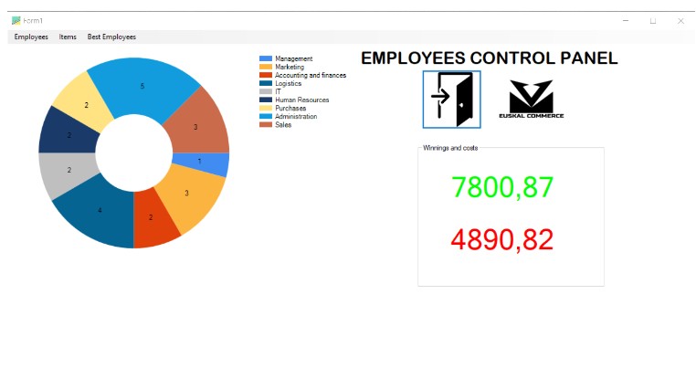
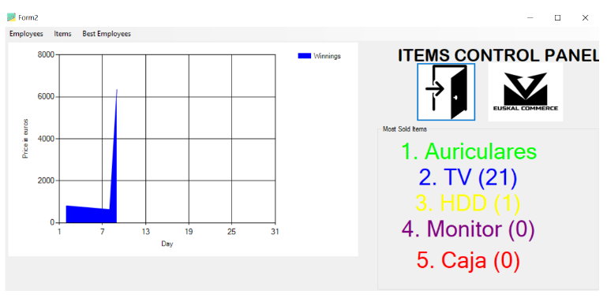
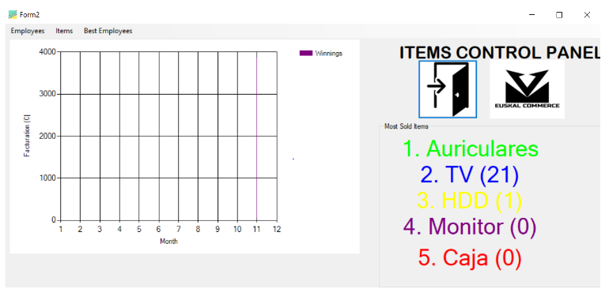
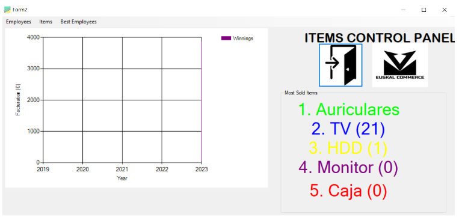
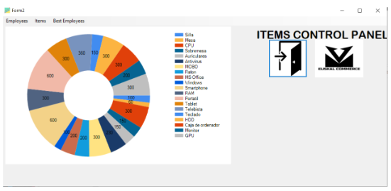

# Control Panel

In this directory you can find the project folder of the Control Panel that is going to be developed for the manager.

This Control Panel is going to be developed using C# using Windows Forms Application (.NET framework). The Control Panel will be able to connect to a PostgreSQL database and will also be able to process that data to show different types of graphic and views.

## Context

This Control panel is designed and developed for the sales representants of the enterprise. The main idea is to show what employees are working in the enterprise and the movement of the products (how many products are in stock, most sold items, sold items daily, monthly and yearly and all the profits).

## User Guide

### Main Menu

In the main menu you have the amount of employees in a chart on which you can see how many employees are in each department and also the names of the departments, you can also exit from the panel by clicking the door image and you can see our enterprise logo. Apart from that, you can see the revenue and the costs of all items on the enterprise. On top of the panel you can change the graphics.

### Products

Depending on what you clicked, you can see the purchases daily, monthly and yearly. Apart from that you can also see how many products we have in stock and the quantity of them. If you clicked on daily, monthly or yearly, you will see the best selling items. 

#### DAILY

#### MONTHLY

#### ANNUAL

#### IN STOCK

### Best Employees

In the Best Employees menu, you will see the most efficient employees ( the employees that made the most orders). 
