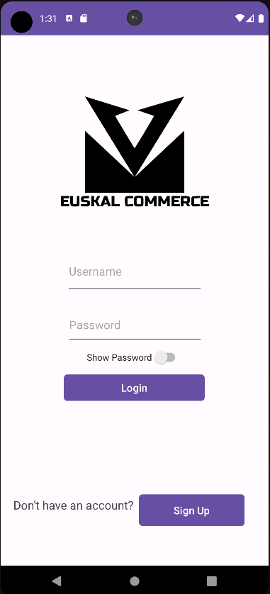
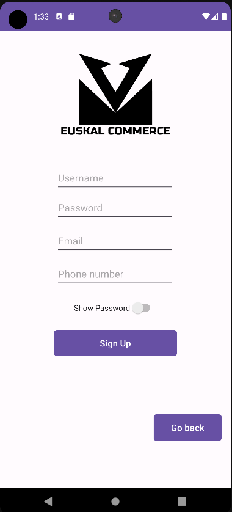
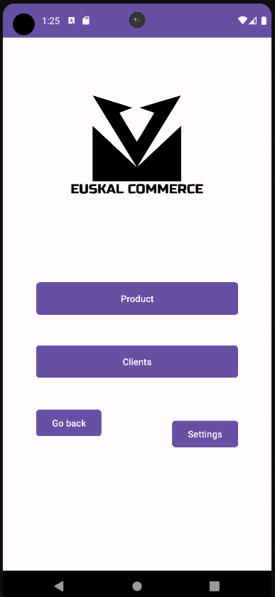
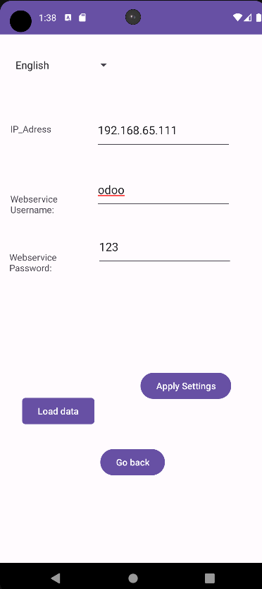
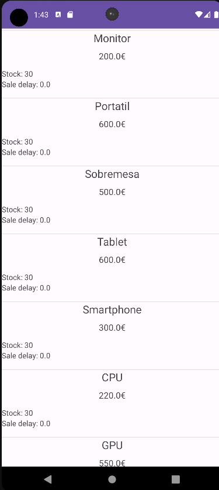
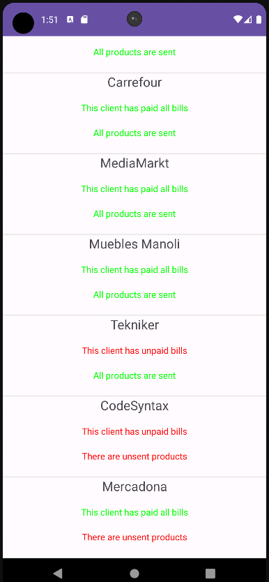
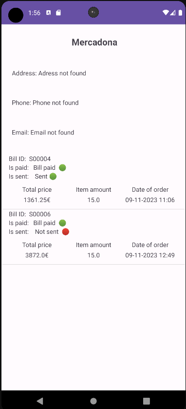

# CommerceApp

### Context
This application is developed for the sales representatives at your company. The main idea is for the sales reps to have all the necessary information about the products we sell, clients we sell to and the status of the bills of our clients available at a glance in our application.  

### User guide
#### logging in a signin up
When opening the app you will be greeted with the login screen. If you have an account you can enter your information and log into the app.

To sign up in the app you can click in the "Sign up" button in the login screen and it will take you to the sign up screen.

Once you enter the data, you can go back and login normally.
#### The main menu

In the main menu you have options to look the products that we offer, as well as the clients we sell to. When oppening the app for the first time, this 2 options will be blank because we haven't pulled any data from odoo yet. To load data from odoo, we will have to click on the "Settings" button and configure the app.
#### Settings

In the settings screen, you can select your preferred language and configure the parameters to connect with odoo. Ask your system administrator for the details to connect with the database.
Once your parameters are set with the "Apply settings" button, you can click the "Load data" button and, if there are no problems, the data from your company's odoo database will be loaded into the application.
#### Products

In this screen you will see all the saleable products that your company offers.
The information shown in this screen is the products name, price, stock delay and current stock.
You can use this information to rapidly check what products are available to sell and when they will be able to arrive for your clients.
#### Clients

In the clients screen you will see a list of all the clients in your company's database, as well as some text telling you if those clients have unpaid bill or they haven't received your products.

You can click on one of the clients to see more information about them in the client details screen.

In this example, we have clicked on the "Mercadona" demo client and we can see the data for the bills that client has oppened.

