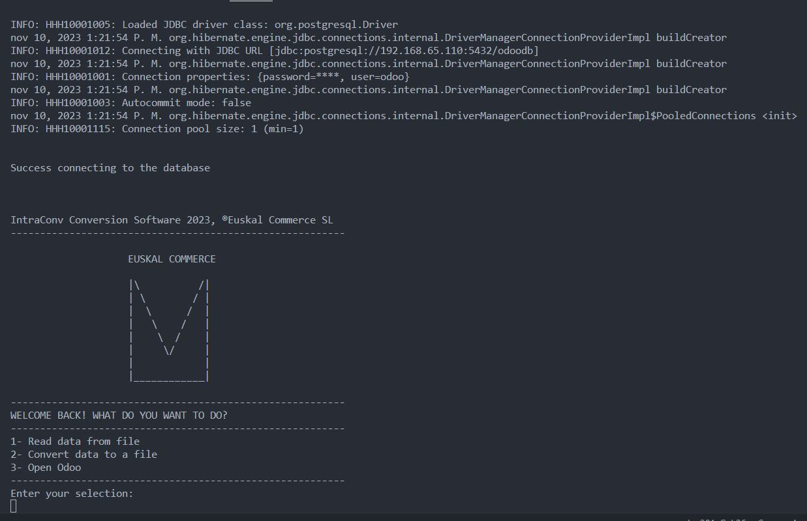
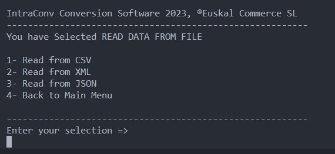
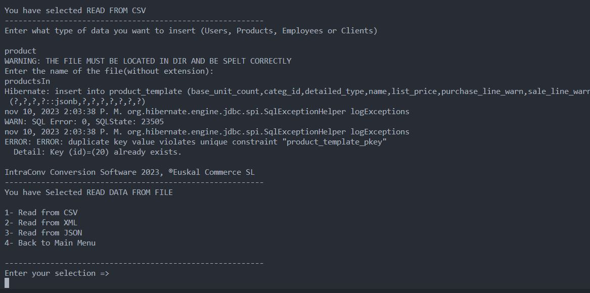
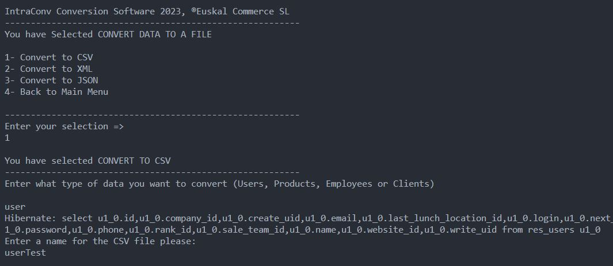
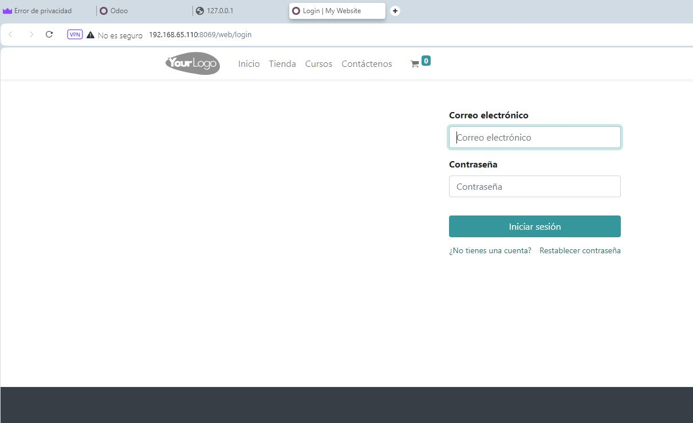

# IntraConv

IntraConv is an internal software developed in Java that is going to be used to do the data treatment. 

This software is going to be able to read data in different formats directly from the PostgreSQL using Hibernate (ORM) and transform it to other formats like Csv, Xml and JSON.

IntraConv is going to be located behind Odoo and is going to operate directly with the PostgreSQL.

## Context

The Java Conversion App is a software designed for converting the data of Users, Products, Clients and Employees that the user extracts directly from the PostgreSQL database. This software uses a bidirectional connection mode using the Hibernate ORM. 

We have mapped these four key elements. The user can extract all the data of users for example and convert it into a CSV, XML or JSON file. He can also take a CSV, XML or JSON file with new data and upload to the database. The software reads the file and using the mapping inserts the new data to the corresponding table. 

## User Guide

When the app is execute the user it redirect to the main menu. The app first makes the connection to the databases and if the connecvtion was successfull the main menu is shown. Inside that menu the user is asked what functionality is wanting to execute and it waits until the user enters his option.

If the user enters the first option a sub menu will be displayed and the app will ask again the user which functionality wants to execute.

The user can choose if he want to read from a CSV, XML or JSON file. When he make his decision and enters the option a new panel will be displayed. The app will ask the user what type of data is going to work with, the option are users, products, employees or clients. The user has to write the option he want to work with, in this sense the app gives liberty of typing in upper case, lower case, the name in plural etc. The user is not forced to strictly write the word as it is shown. 

Once he user enters the wished data, the app will ask for the file he want to read. In this case the user must write strictly the filename as it is created because he has to find the exact path to the file. Once he enters the name of the file the app will insert the data to the corresponding table and the sub menu will be dispalyed again in case that the user wants to read another different file. If he chooses the back option it will be moved to the main menu.

Going back to the main menu and showing the app the wish to convert a file, the app will show another sub menu. In this case the converting file sub menu will be displayed, and as happends in the reading sub menu the user will be asked if he want to convert the data to a CSV, XML or JSON file. The next step is to enter the type of data he wants to work with, he will need to write it. After that he will be asked to enter a name for that file. Once he enters the name the file will be created.

Finally, if the user want to open Odoo and do some changes in the ERP he can display the login of Odoo using the third option of the main menu. If he enters the third option the app will create a process and the Odoo website will be displayed.

