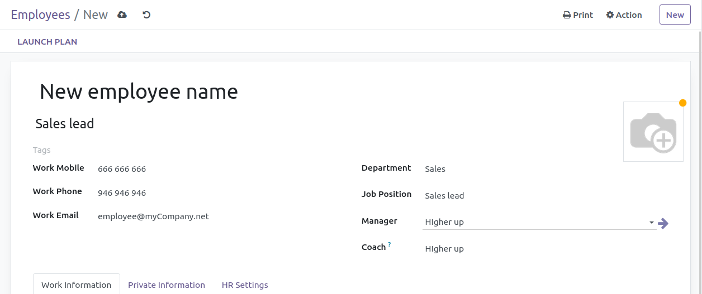

# Odoo

Odoo is an ERP used by enterprises to organize their economic activity and to manage their relations with the customers. Odoo is going to be located in a Windows client and is going to be accessible for different users. 

Odoo has to be configured adding different types of users, workers, customers etc. In this folder we are going to store the scripts for Odoo.

This ERP is going to be working directly with our PostgreSQL database, the data that is changed or added in the ERP is going to be shown in the Control Panel also.

### Odoo installation
In our case, we have installed Odoo in a Ubuntu server, using the latest version and following the instructions in the official Odoo documentation. The installation of the server went without issues and it has functioned correctly the whole lenght of the project.

After succesfully following the install instructions, we can navigate to our server's ip in a browser to see that Odoo is up and running.

We then have to fill several fields so our installation is complete. After this we can log into our user and we will be greeted by the Odoo modules selection.

### Selecting modules

Selecting modules for our company is an important step of the implementation. In our case, since our company buys and sells products, we won't be needing a module to control production. These are the modules we have installed in our Odoo installation.

Sales: A very needed module in our installation to manage the selling of our products.

Invoicing: When selling or buying, we will need invoicing to keep track of our costs and revenue.

CRM: A tool to manage the relationship with our clients and ensure that they are satidfied.

Inventory: This module is a must if your company deals with phisical products. Our company is based on phisical     products, so this module will allow us to manage them in our inventory.

Accounting: Necessary module to keep track of our company's cash flow and status.

Purchase:Since our company will deal with suppliers and buying stock from other companies, we will need this module to be able to keep track of those purchases.

This modules are the ones that are a MUST for our company, and most others, but there are several modules that could be implemented as quality of life improvements if management is onboard with it. Modules like Calendar, Live chat, Attendances, Expenses, Recruitment or Time Off are not needed but their implementation could make those task more centralized and powerful.

After selecting the modules we want, is time to create our company, create employees and users, do some purchases and sell some products.

### Company structure
We have several workers in our company, that work in different departments. To represent this in Odoo we can navigate to the "Employees" section of the application and start creating them.

When creating employees, we will have to give them a proper department and higher up. Once we have created all our employees, we can start creating users for them.

Once we have created all the users and departments, we will have to grant some of those users access to Odoo.

### Creating users
Not every employee must be a user. Some of them have jobs that don't require access to the Odoo software. We have to take this into account when creating users.
To create users, we have to log in with the administrator user or a user that has administrator access (in our case those will be the IT workers) and navigate to the employee that we want to create the user for. Once there we can click on the gear icon to bring up more options and select the "create user" option.

 Once clicked, you will see a screen that allows you to set different rights to that user. Be careful with how you administer these, since it will control admin access to the modules you have installed

 

When done, that user will be able to log into Odoo and start working.

### Using Odoo
Once you have created all of your users, you are all set!

Your employees will be able to start making sales and purchases while notifying the clients via email, create new products and manage inventory. We highly reccomend to check out Odoo's official user documentation to train your employees. Here is a list of the documentation for our essential modules:
  * [Accounting and invoicing](https://www.odoo.com/documentation/16.0/applications/finance/accounting.html)
  * [Sales](https://www.odoo.com/documentation/16.0/applications/sales/sales.html)
  * [Inventory](https://www.odoo.com/documentation/16.0/applications/inventory_and_mrp/inventory.html)
  * [Purchase](https://www.odoo.com/documentation/16.0/applications/inventory_and_mrp/purchase.html)
  * [CRM](https://www.odoo.com/documentation/16.0/applications/sales/crm.html)

